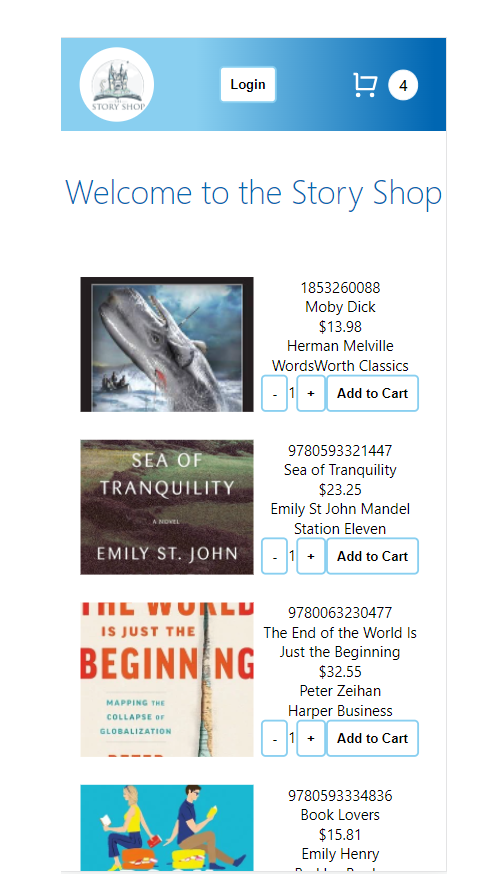

    

# ECommerce Challenge
### Desktop Screen Shot

  

### How to run the project locally.
- clone this repo.
- go to https://reqres.in/
- click on the POST - Login (succesfull) option and copy the response Token string.
- create a .env file and store that Token in a REACT_APP_ACCESS_TOKEN var.
- run command `npm start` and you should be up and running

### About users
- The user with the token from the previous step will be the admin. Every 24 hs https://reqres.in/ change the password (which is the same for all users), so you should check it before singnin in.
- All the other emails (remember, same password) belong to NON-Admin users.

### ADMIN
ADMIN can CREATE books(already functioning), UPDATE or DELETE. Both update and delete are planned to be working in the second stage of this project. However you could delete a book adding the param "/id" in Postman. You could get the id watching redux devtools.
- Requests are made to this endpoint: https://crudcrud.com/api/22923a258ece4eba9cb17a0dd9a9f854/unicorns
- This external api doesn't let us to send headers with the token for authentication, so it will be implementented in the next stage of this project, in conjunction with backend services, looking like: 

    `
    {
        headers: {
         authorization: `Bearer ${token}`
          }
    }
    `

